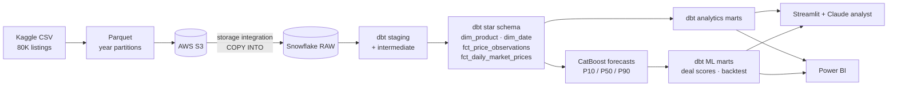

# Apple Product Pricing Intelligence


## Project Overview

**Apple Product Pricing Intelligence** is an end-to-end cloud analytics and machine-learning project built on **80,000 Apple pricing records** covering **31 product models**, **4 categories** (iPhone, iPad, Mac, Apple Watch), and **2 marketplaces** (Amazon and Flipkart) from September 2020 to July 2026.

Raw data lands in **AWS S3** as partitioned Parquet and is loaded into **Snowflake**. It is then modeled with **dbt** into a tested star schema and analytics data marts. The marts feed a statistical analysis notebook, **CatBoost** 7- and 30-day price forecasts with calibrated prediction intervals, a **Streamlit** dashboard with a buy-now / wait deal finder and a **Claude**-powered SQL analyst, and a **Power BI** report.

The project answers how Apple products lose value over their life cycle, what new launches and sale events really do to prices, whether one marketplace is cheaper, and when a buyer should buy or wait.

- **Dataset:** [Apple Products Pricing Dataset (Kaggle)](https://www.kaggle.com/datasets/rhlvrm34/apple-dataset)

## Live Application

Explore the interactive Streamlit application:

- **Website:** https://applepricing.streamlit.app/

## Project Objectives

The project was developed to answer key pricing questions:

- How fast does each product category lose value after release, and which holds value best?
- What happens to a product's price when Apple releases its successor?
- How much do sale events (Big Billion Days, Great Indian Festival, Prime Day, Black Friday) really save compared with the normal price?
- Is Amazon or Flipkart cheaper for the same product on the same day?
- How much cheaper are refurbished units, and does stock availability affect price?
- Can prices be forecast 7 and 30 days ahead accurately enough to recommend **buy now** or **wait**?

## Tools and Technologies

| Layer | Tools |
|---|---|
| Ingestion and storage | **Python**, **AWS S3** (boto3, least-privilege IAM), Parquet with year partitions |
| Warehouse | **Snowflake** (storage integration, external stage, `COPY INTO`, RBAC roles); **DuckDB** for local development and CI |
| Transformation and testing | **dbt** (staging → intermediate → star schema → marts, 64 data tests, custom generic tests, seeds) and **SQL** |
| Analysis | **pandas**, **NumPy**, **SciPy** (Wilcoxon, bootstrap), **statsmodels** (fixed-effects OLS, HC3), Matplotlib and Seaborn |
| Machine learning | **CatBoost** multi-quantile regression, split-conformal calibration, **SHAP** |
| Applications | **Streamlit** and **Plotly**; **Claude** (Anthropic API) for the natural-language SQL analyst; **Power BI** |
| Engineering | pytest, GitHub Actions CI, a single-command pipeline with dev (DuckDB) and prod (S3 + Snowflake) targets |

## Data Preparation

### Architecture



The same dbt project runs on **Snowflake** (`--target prod`) and on a local **DuckDB** file (`--target dev`). Dialect differences go through dbt's cross-database macros, so CI can build and test every model without cloud credentials.

### Data quality and modeling

- Mapped the raw CSV onto a fixed schema and landed it as **year-partitioned Parquet** in the same layout locally and in S3.
- **Staging** (`stg_apple_prices`) standardizes platform, condition (New / Refurbished), sale-event, and stock labels; drops INR columns (USD is the analysis currency); recomputes the discount from prices; and removes exact duplicate snapshots with a hash key.
- Found **21,389 extra listings** that share a date × platform × model × condition, about 1.4 listings per series-day. All time-series work therefore uses the **series-day grain** (`fct_daily_market_prices`, 58,611 rows).
- Added a **product catalog seed** with official release dates, product lines, tiers, and successor models. Product age is measured from Apple's release date, not from the first day a product appears in the data.
- Built a leakage-free **"normal price" baseline** per series: the mean of the previous 30 non-event observations, excluding the current day.
- **64 dbt data tests** cover uniqueness and grain, accepted values, ranges, referential integrity, and business rules such as *reported discount = (MSRP − price) / MSRP* and *no listing before release*. All pass.
- **Data caveat:** some patterns look simulated. Ratings are uncorrelated with review counts (Spearman 0.003), and Amazon is cheaper on almost exactly half of matched days. Findings describe this dataset, but the pipeline itself runs unchanged on scraped data.

## Analysis Results

The full analysis is in [`notebooks/apple_pricing_analysis.ipynb`](notebooks/apple_pricing_analysis.ipynb).

**1. Mac holds value best; prices fall in annual steps.** iPhone, iPad, and Apple Watch trade at MSRP for about 11 months, then step down at months 12, 24, and 36, one step per successor launch. They flatten near 60% of MSRP after roughly three years. Mac stays above 90% of MSRP for two years.


**2. The successor-launch cliff.** In the 60 days after its successor ships, the previous model's price drops **14.6% for iPhone** and **20.0% for Apple Watch** on average (7.9% for iPad). Mac prices barely move (−0.1%). The drop is statistically significant across 21 models (Wilcoxon p = 0.0001).


**3. Sale events save less than the headline suggests.** Headline discounts versus launch MSRP are 33–39%, but most of that is depreciation that already existed. Measured against each product's normal (non-event) price, events save **16–25%**, and a fixed-effects regression that controls for model, age, platform, condition, and season gives **14–22%**. **Big Billion Days** is the strongest event (24.8% vs normal) and **Black Friday** the weakest (16.0%). Still, 98–99% of event days save at least 5%.


**4. Neither marketplace is cheaper, but they differ day to day.** Across 12,669 matched product-days, Amazon is cheaper 50.4% of the time. The median gap is −0.01% (95% CI within ±0.06%), and the paired Wilcoxon test gives p = 0.24. On a given day, though, the platforms differ by **2.7%** in a random direction, so it pays to check both.

**5. Refurbished units are about 22.5% cheaper** than new units of the same model on the same platform and day. The effect is consistent across categories (regression: −22.7%).

**6. Stock status is a confounding trap.** Out-of-stock listings look about 10 price-index points cheaper, but they are simply older products (about 970 vs 570 days since release). After controlling for model and age, the effect is about **0%** and not significant.

**7. Above-MSRP pricing is a launch phenomenon.** About 11% of listings sit up to 2% above MSRP, and 99.7% of them fall in the product's first year.

**Recommendations.** Buyers should buy the outgoing iPhone or Apple Watch in the two months after its successor launches, or wait for Big Billion Days or Great Indian Festival. They can consider refurbished units for a further ~22% saving and should compare both marketplaces on the day. Retailers should expect a 15–20% price reset on outgoing iPhone and Watch stock at launch and clear inventory beforehand; Mac inventory carries far less launch risk.

## Machine Learning

Two **CatBoost multi-quantile models** forecast each series' price **7 and 30 days ahead**, returning P10, P50, and P90.

The modeling workflow included:
- **Calendar-time features** built with as-of joins, because the series are irregular. A "7-day lag" is the last price at least 7 days earlier, not 7 rows earlier. Features include returns over 7/14/30/60 days; position against the 7/30/90-day rolling mean, min, and max; volatility; the other marketplace's price; product and successor age; sale events; and calendar fields.
- A **log price-ratio target** (future / current), so one model serves $329 iPads and $1,999 MacBooks.
- A **chronological train / validation / test split** with an embargo of *horizon + 3 days* between folds, so no training target overlaps a later fold. The test set is the final 180 days.
- **Two baselines:** the naive last price and the trailing 30-day mean. The model has to beat the stronger one.
- **Split-conformal calibration** of the P10–P90 interval on the validation fold, plus unit tests for leakage safety, the embargo, and interval coverage.

| Horizon | Model MAE | Naive last price | Trailing 30-day mean | Improvement vs naive | Improvement vs 30-day mean | WAPE | P10–P90 coverage |
|---|---|---|---|---|---|---|---|
| 7 days | **$14.60** | $23.21 | $18.12 | **37.1%** | **19.4%** | 1.95% | 84.3% |
| 30 days | **$16.70** | $21.35 | $18.30 | **21.8%** | **8.7%** | 2.23% | 82.8% |


SHAP analysis shows the models learned two mechanisms. The first is **mean reversion**: a price far below its normal level is predicted to rebound. The second is **timing**: days since release, week of year, and month capture sale seasons and the September launch cycle.

The forecasts feed a dbt mart (`mart_deal_scores`) that labels each of the 124 platform × model × condition series **Buy now**, **Wait**, or **No rush** and ranks them with a 0–100 deal score. The labels are 28 Buy now, 28 Wait, and 68 No rush.

## Application Features

The Streamlit application allows users to:

- **Overview:** view headline KPIs, key findings, the dbt test status, and value retention by category
- **Price Explorer:** see any model's daily price by platform and condition, with MSRP, sale-event days, and successor launch marked
- **Depreciation & Launches:** compare depreciation curves and see the successor-launch cliff for every model
- **Sale Events:** compare the headline discount with real savings against the normal price, by event and category
- **Platforms & Condition:** review the matched Amazon vs Flipkart gap distribution and refurbished discounts by model
- **Forecasts:** check model vs baseline accuracy, a backtest with the P10–P90 band for any series, and feature importance
- **Buy or Wait:** get a recommendation, the reason, the 7/30-day forecasts, and a deal score for every series
- **AI Analyst:** ask questions in plain English. Claude writes read-only SQL against the marts in a sandboxed in-memory DuckDB (a single SELECT only, with file access disabled and configuration locked) and shows every query it ran.
- **Data & Pipeline:** see the pipeline lineage, the latest dbt build results, and the data dictionary

Sidebar filters for category, platform, condition, and date range apply across tabs. A Power BI report specification (star schema, DAX measures, and pages) is in [`powerbi/`](powerbi/README.md).

## Project Result

The final project delivers:

- An S3 → Snowflake ingestion path with partitioned Parquet, a storage integration, incremental `COPY INTO`, and least-privilege IAM and Snowflake roles
- A dbt project with 13 models, a reference seed, and **64 passing data tests**, running on both Snowflake and DuckDB
- A statistical analysis with matched-pair tests, bootstrap confidence intervals, and fixed-effects regression
- Calibrated 7- and 30-day CatBoost forecasts that beat both a naive and a smoothed baseline
- A buy-now / wait deal-scoring mart built on the forecasts
- A deployed Streamlit application with a Claude-powered SQL analyst
- A Power BI-ready star schema and report specification
- A single-command pipeline, unit tests, and GitHub Actions CI

### Repository structure

```
├── app.py                      Streamlit entry point
├── dashboard/                  Dashboard views, theme, Claude analyst, SQL sandbox
├── src/apple_pricing/
│   ├── ingest/                 CSV → Parquet, S3 upload, DuckDB / Snowflake loaders
│   ├── forecasting/            Feature engineering and model training
│   ├── warehouse.py            DuckDB / Snowflake abstraction
│   └── pipeline.py             End-to-end orchestration
├── dbt/                        Models, seeds, tests, macros (dev: DuckDB, prod: Snowflake)
├── infra/                      Snowflake setup / load SQL and AWS IAM policies
├── notebooks/                  Analysis notebook
├── data/raw/                   Source dataset
├── data/marts/                 Mart exports read by the app
├── reports/figures/            Figures used in this README
├── powerbi/                    Power BI model and report specification
└── tests/                      Unit tests
```

## How to Run

```bash
python -m venv .venv
source .venv/bin/activate            # Windows: .venv\Scripts\activate
pip install -r requirements-pipeline.txt
pip install -e .

python -m apple_pricing.pipeline     # extract → DuckDB → dbt → train → dbt ML marts → export
streamlit run app.py
pytest
```

**Cloud path (S3 + Snowflake).** Run `infra/snowflake/01_setup.sql` and `02_s3_integration.sql` once, and create the IAM role from `infra/aws/`. Set `SNOWFLAKE_ACCOUNT`, `SNOWFLAKE_USER`, `SNOWFLAKE_PASSWORD`, and AWS credentials, then run:

```bash
python -m apple_pricing.pipeline --target prod --bucket <your-bucket>
```

**AI Analyst.** Add `ANTHROPIC_API_KEY` to `.streamlit/secrets.toml` locally, or to the app's secrets on Streamlit Community Cloud.

## Contacts
For any inquiries or questions regarding the project, please contact me at: dbui10@fordham.edu
