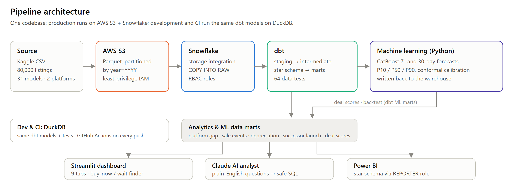
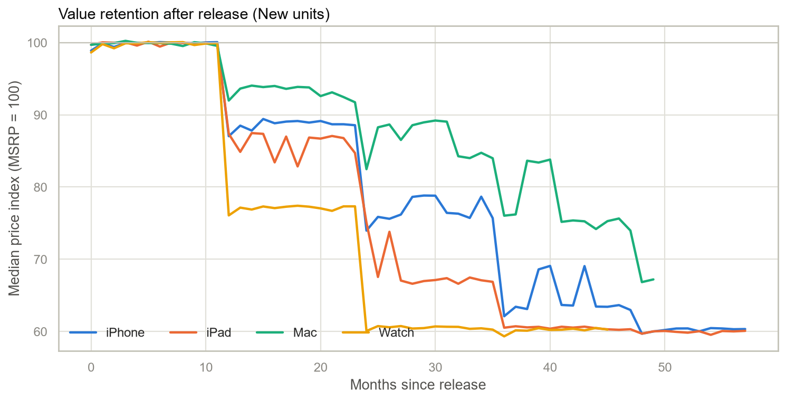
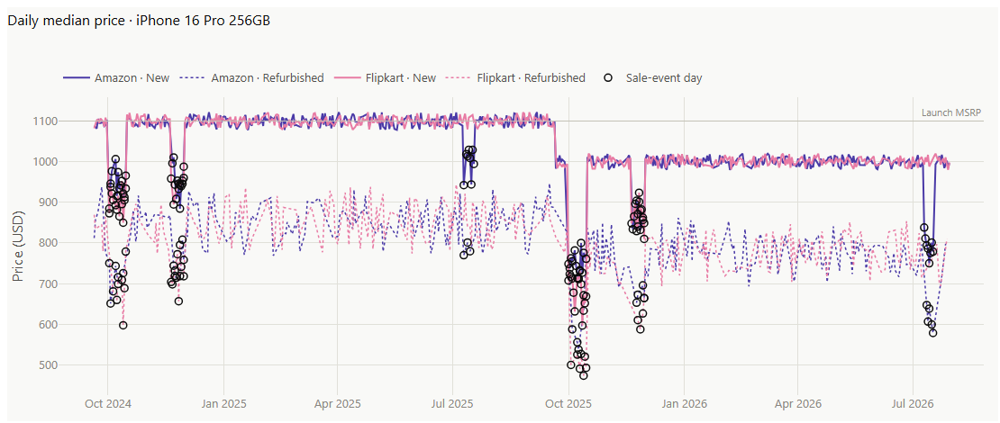
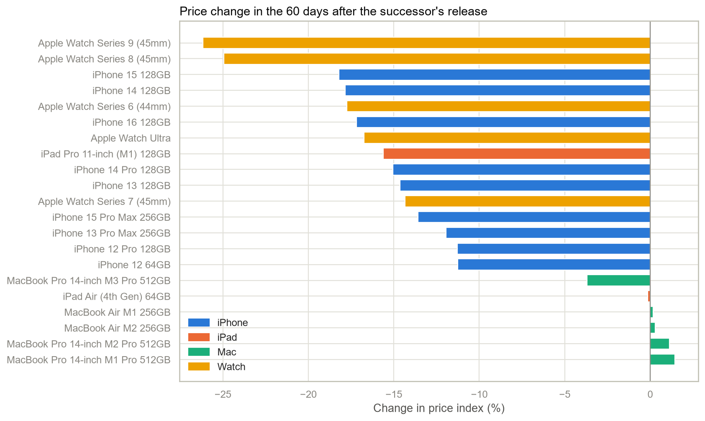
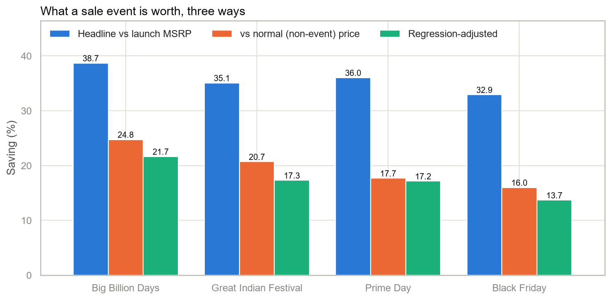
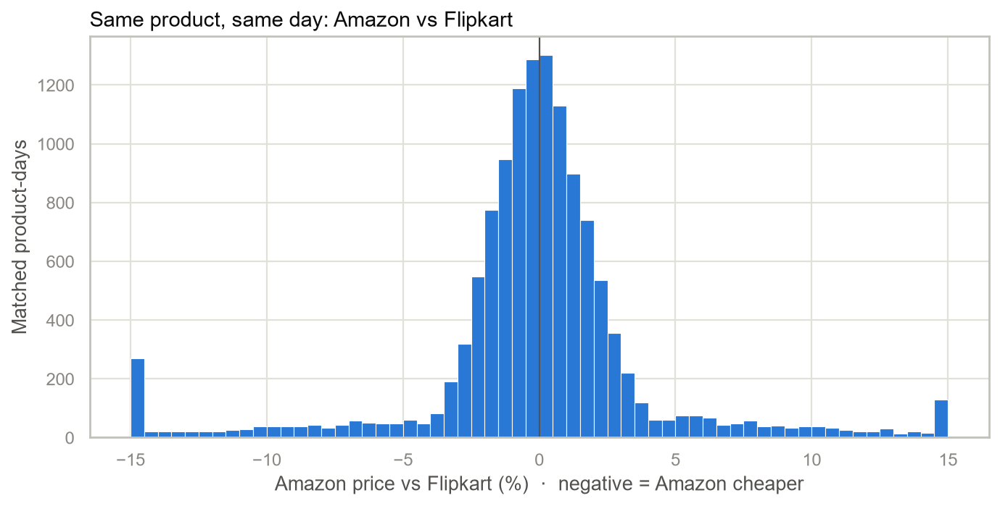
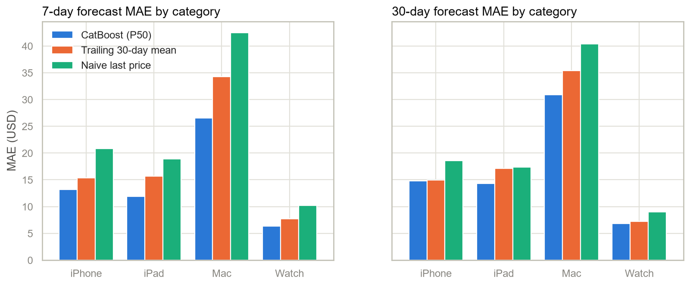
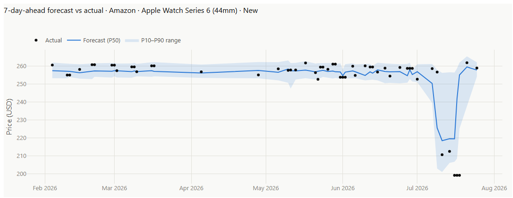
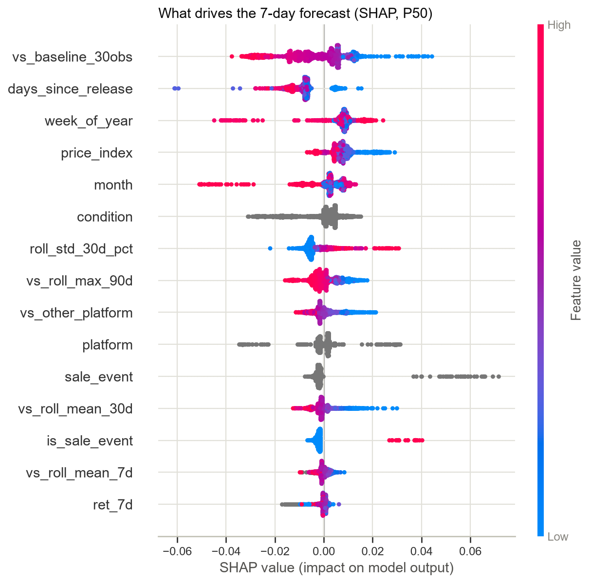

# Apple Product Pricing Intelligence — Final Report

**Author:** Quan Bui · **Date:** September 2026

**Live app:** [applepricing.streamlit.app](https://applepricing.streamlit.app/) · **Code:** [github.com/DQuanBui/Apple_Product_Pricing_Intelligence](https://github.com/DQuanBui/Apple_Product_Pricing_Intelligence)

---

## 1. Why I Built This

I started this project out of curiosity. In April 2026 Apple announced that **John Ternus**, its Senior Vice President of Hardware Engineering, would succeed Tim Cook as CEO, and he took over on **September 1, 2026**. Ternus joined Apple in 2001 and spent 25 years building the products themselves, leading hardware engineering for iPad, AirPods, and recent iPhone models. A hardware engineer becoming CEO made me look at Apple through its products and their life cycle: the annual launch rhythm, how long each generation stays "current", and what happens to a product's value once the next one ships.

Apple sets launch prices, but after launch the market decides what a product is worth. I wanted to see that side with data:

- How quickly does each product line lose value, and which line holds it best?
- What does a new launch do to the price of the model it replaces?
- Are the big marketplace sale events real bargains, or mostly marketing?
- Can the next month's price be predicted well enough to tell a buyer to **buy now** or **wait**?

I also used the project to build a data stack the way a production analytics team would: cloud storage, a warehouse, tested transformations, machine learning, and self-service dashboards.

## 2. Executive Summary

Using **80,000 price records** for **31 Apple models** sold on **Amazon and Flipkart** (September 2020 – July 2026), I built an end-to-end pipeline:

- Storage: AWS S3.
- Warehouse and transformation: Snowflake with dbt, backed by 64 automated data tests.
- Analysis and forecasting: a statistical analysis notebook and CatBoost price forecasts.
- Delivery: a Streamlit dashboard with a Claude-powered SQL analyst.

| # | Finding | Evidence |
|---|---|---|
| 1 | **Prices fall in annual steps, not smoothly.** iPhone, iPad, and Watch sit at launch price for about 11 months, then step down at months 12, 24, and 36. | Median price index by months since release |
| 2 | **Successor launches trigger a price cliff.** The previous model drops **14.6% (iPhone)** and **20.0% (Watch)** within 60 days; **Mac barely moves (−0.1%)**. | 21 models, Wilcoxon p = 0.0001 |
| 3 | **Mac holds value best.** Macs stay above 90% of launch price for two years; iPhone and iPad fall below 90% at month 12. | Depreciation curves |
| 4 | **Sale events save less than advertised.** Headline discounts of 33–39% are really **16–25%** below the product's normal price (14–22% after statistical controls). Big Billion Days is the best event, Black Friday the weakest. | Three measurement methods agree |
| 5 | **Neither marketplace is cheaper overall.** Amazon is cheaper on 50.4% of matched days (p = 0.24), but the two differ by **2.7%** on any given day. | 12,669 matched product-days |
| 6 | **Refurbished units are about 22.5% cheaper** than new units of the same model, on the same platform and day. | Matched comparison and regression |
| 7 | **Stock status doesn't drive price.** The apparent 10-point gap disappears once product age is controlled, because out-of-stock items are simply older. | Fixed-effects regression |
| 8 | **Prices are forecastable.** 7-day forecast error is **$14.60** (1.95% of price), **37% better than the naive baseline** and **19% better than a 30-day average**, with calibrated 80% ranges. | Held-out final 180 days |

**Bottom line for a buyer:** buy last year's iPhone or Watch in the two months after the new one launches, or wait for Big Billion Days or Great Indian Festival. A refurbished unit saves another ~22%. Check both marketplaces on the day.

## 3. Business Problem

Apple product prices on large marketplaces change constantly with launches, sale events, stock, and competition between sellers. Three audiences need to understand those movements:

| Audience | Question | What this project gives them |
|---|---|---|
| **Buyers** | Should I buy now or wait, and where? | Buy-now / wait calls with 7- and 30-day forecasts, and the best event and platform |
| **Retailers and category managers** | When will my inventory lose value? | The successor-launch cliff by category, and depreciation curves |
| **Pricing and marketing analysts** | Do sale events actually move prices? | Event effects measured against the normal price, controlled for product mix |

**Success criteria:**
1. Answer each question with a reproducible, tested number.
2. Beat simple forecasting baselines on unseen data.
3. Deliver the results in tools non-technical users can explore.

## 4. Data

| Item | Detail |
|---|---|
| Source | Public Kaggle dataset, *Apple Products Pricing 2020–2026* |
| Size | 80,000 listing snapshots, 14 columns |
| Coverage | 31 models · 4 categories (iPhone, iPad, Mac, Watch) · Amazon and Flipkart · New and Refurbished · 2020-09-19 to 2026-07-31 |
| Key fields | Date, platform, model, condition, launch price, current price (USD and INR), discount %, sale event, stock status, rating, review count |
| Sale events | Big Billion Days, Great Indian Festival, Prime Day, Black Friday (8.3% of listings) |

**Added reference data:** a product catalog with each model's official release date, product line, tier, chip, and successor model. This lets product age be measured from Apple's real launch date instead of the first day the product appears in the data.

**Data caveat.** Some patterns look simulated rather than scraped. Ratings are uncorrelated with review counts (Spearman 0.003), and Amazon is cheaper on almost exactly half of matched days. The findings therefore describe this dataset. The pipeline is built so that real scraped prices could flow through it unchanged.

## 5. Solution Architecture



| Layer | Technology | What it does |
|---|---|---|
| Ingestion | Python, Parquet | Converts the CSV into year-partitioned Parquet files |
| Storage | **AWS S3** | Stores the raw partitions (`raw/apple_pricing/year=YYYY/`), with least-privilege IAM roles for upload and read |
| Warehouse | **Snowflake** | Loads S3 through a storage integration and external stage with incremental `COPY INTO`; separate roles for transformation (`TRANSFORMER`) and reporting (`REPORTER`) |
| Transformation | **dbt** | Staging → intermediate → star schema → analytics marts, 64 data tests |
| Machine learning | **CatBoost**, SHAP | 7- and 30-day quantile forecasts, written back to the warehouse |
| Applications | **Streamlit**, Plotly, **Claude API**, **Power BI** | Interactive dashboard, natural-language analyst, BI report |
| Engineering | pytest, GitHub Actions | Unit tests and a full dbt build and test on every push |

**One codebase, two environments.** The dbt models and Python code run against Snowflake in production (`--target prod`) and against a local DuckDB file in development and CI (`--target dev`). SQL differences between the two databases go through dbt's cross-database macros, so every model and test can be verified without cloud credentials. The whole pipeline runs with one command: `python -m apple_pricing.pipeline`.

## 6. Data Preparation and Modeling

### 6.1 Data quality

| Check | Result |
|---|---|
| Missing or invalid dates, prices, ratings, reviews | 0 rows |
| Exact duplicate snapshots | 0 (removed by a hash key if they ever appear) |
| Reported discount vs (launch price − price) / launch price | 0 mismatches beyond 0.15 pp |
| Listings dated before the product's release | 0 |
| Listings sharing date × platform × model × condition | **21,389** (about 1.4 listings per series-day) |

The last row shaped the whole design. Several listings of the same product appear on the same day, so all time-series work uses one row per **series-day** (platform × model × condition × date, 58,611 rows), taking the median price across listings.

### 6.2 dbt model layers

| Layer | Models | Purpose |
|---|---|---|
| Staging | `stg_apple_prices` | Standardize labels (New / Refurbished, "No Event"), drop INR columns, recompute the discount, remove duplicates |
| Intermediate | `int_daily_market_prices` | Roll listings up to series-days |
| Core (star schema) | `dim_product`, `dim_date`, `fct_price_observations`, `fct_daily_market_prices` | Conformed dimensions, and facts at listing and series-day grain |
| Analytics marts | platform gap, sale-event impact, depreciation curve, successor-launch impact, model scorecard | One table per business question |
| ML marts | `mart_deal_scores`, `mart_forecast_backtest` | Buy / wait calls and forecast accuracy, built from the model output |

A key design choice is the **"normal price" baseline** for each series: the average of its previous 30 **non-event** observations. It excludes sale days, so a sale can't lower its own benchmark, and it excludes the current day to avoid look-ahead. This baseline is how the analysis separates real event savings from ordinary depreciation.

### 6.3 Testing

The **64 dbt data tests** cover uniqueness of every model's grain, accepted values, numeric ranges, referential integrity between facts and dimensions, and business rules. **24 Python unit tests** cover the forecasting logic (no data leakage, the embargo gap, interval coverage) and the AI analyst's SQL safety rules.

## 7. Analysis and Findings

### 7.1 Price level and value retention by category

| Category | Listings | Avg. price | Median price index* | Avg. discount vs launch |
|---|---|---|---|---|
| iPhone | 28,589 | $758.67 | 82.0 | 19.6% |
| iPad | 15,526 | $573.08 | 71.4 | 26.2% |
| Mac | 18,020 | $1,382.49 | 88.8 | 15.4% |
| Watch | 17,865 | $398.64 | 75.1 | 26.3% |

*Price index = current price ÷ launch price × 100 (100 = selling at launch price).

Mac is the most expensive category and also holds value best. About 11% of listings sell slightly above launch price (at most 2% above), and **99.7% of those are in the product's first year**. Premium pricing is a launch-window effect only.

### 7.2 Prices fall in annual steps



| Category | Index at 12 months | 24 months | 36 months | First month below 90 | First month below 80 |
|---|---|---|---|---|---|
| iPhone | 87.0 | 74.0 | 62.1 | 12 | 24 |
| iPad | 87.4 | 75.1 | 60.5 | 12 | 24 |
| Mac | 92.0 | 82.5 | 76.0 | 24 | 36 |
| Watch | 76.1 | 60.1 | 59.3 | 12 | 12 |

Prices don't erode gradually. iPhone, iPad, and Watch hold their launch price for about 11 months, then drop in steps at months 12, 24, and 36, each one lining up with the next generation's release. They settle near 60% of the launch price after about three years. Mac shows the same shape with much smaller steps.



*Example: iPhone 16 Pro. New-unit prices hold near launch price for a year, then step down when the September 2025 lineup arrives. Circles mark sale-event days.*

### 7.3 The successor-launch cliff



**Method.** For each of the 21 models with a tracked successor, I compared the average price index of New units in the 60 days before the successor's release with the 60 days after it.

| Category | Avg. change | Models |
|---|---|---|
| Watch | **−20.0%** | 5 |
| iPhone | **−14.6%** | 9 |
| iPad | −7.9% | 2 |
| Mac | −0.1% | 5 |

The drop is statistically significant across models (Wilcoxon signed-rank, p = 0.0001). The largest single drops were Apple Watch Series 9 (−26.2%) and Series 8 (−25.0%).

**Why it matters.** For iPhone and Watch, the successor launch is the single biggest price event in a product's life, bigger than most sale events. Buyers get the best price on the outgoing model right after launch. Retailers holding outgoing iPhone or Watch stock face a 15–20% price reset on launch day. Mac inventory carries far less launch risk.

### 7.4 Sale events: headline vs real savings



I measured each event three ways, from least to most rigorous:

| Event | Headline vs launch price | vs normal price | Regression-adjusted | Event days saving ≥ 5% |
|---|---|---|---|---|
| Big Billion Days | 38.7% | **24.8%** | 21.7% | 99.2% |
| Great Indian Festival | 35.1% | 20.7% | 17.3% | 98.7% |
| Prime Day | 36.0% | 17.7% | 17.2% | 97.8% |
| Black Friday | 32.9% | 16.0% | 13.7% | 98.7% |

- *Headline* compares the event price to the launch price, which is what marketing typically shows.
- *vs normal price* compares it to the product's own recent non-event price.
- *Regression-adjusted* comes from a fixed-effects model of log price. It controls for model, product age, platform, condition, stock status, month, and year (80,000 rows, R² = 0.989, HC3 robust errors).

**Finding.** Roughly half of the headline discount is depreciation the product had already accumulated. Events still deliver real savings of 14–25%, and almost every event day saves at least 5%. Big Billion Days is consistently the strongest event and Black Friday the weakest.

### 7.5 Amazon vs Flipkart



| Metric | Value |
|---|---|
| Matched product-days (same model, condition, and day on both platforms) | 12,669 |
| Amazon cheaper | 50.4% |
| Median gap | −0.01% (95% bootstrap CI −0.05% to +0.03%) |
| Wilcoxon signed-rank test | p = 0.24 (not significant) |
| Regression platform effect | +0.03% (p = 0.54) |
| Average gap on a given day, either direction | **2.7%** |

Neither marketplace is systematically cheaper, but on any given day their prices differ by about 2.7%. The practical advice is simply to compare both before buying.

### 7.6 New vs refurbished

On the same platform and day, a refurbished unit is **22.5% cheaper** than a new one. The discount is nearly identical across categories (22.5–22.7%), and the regression estimate is −22.7%. Combined with the successor cliff, a refurbished previous-generation iPhone bought after launch costs about **34% less** than a new one did before launch.

### 7.7 Stock status: a confounding trap

| Stock status | Avg. price index | Avg. days since release |
|---|---|---|
| In Stock | 81.6 | 569 |
| Low Stock | 72.7 | 910 |
| Out of Stock | 71.3 | 970 |

A simple comparison suggests out-of-stock items are about 10 points cheaper. They are really **older products**, and older products are cheaper. After controlling for model and age, the stock effect is −0.1% (low stock) and 0.0% (out of stock), neither significant. This is a textbook case of a confounding variable, and a reminder to test before reading cause and effect into a group comparison.

## 8. Price Forecasting

### 8.1 Approach

| Design choice | Why |
|---|---|
| **Forecast horizons of 7 and 30 days**, one model each | Match a buyer's short-term "buy now or wait?" decision |
| **Calendar-time features** built with as-of joins | Each series is priced on only ~22% of days, so "7 days ago" must mean the last price at least 7 days earlier, not 7 rows earlier |
| **Features:** 7/14/30/60-day returns; position vs 7/30/90-day rolling mean, min, and max; volatility; the other marketplace's price; product and successor age; sale event; calendar | Capture momentum, mean reversion, competition, life cycle, and seasonality |
| **Target:** log(future price ÷ current price) | One model can serve $329 and $1,999 products |
| **Model:** CatBoost multi-quantile (P10 / P50 / P90) | Handles categorical features natively and gives a price range, not just one number |
| **Chronological split with an embargo** of horizon + 3 days between train, validation, and test; test = the final 180 days | Prevents training targets from overlapping later periods, a common source of inflated results |
| **Two baselines:** last price, and the 30-day average | The model has to beat the stronger, smoothed baseline to be worth using |
| **Split-conformal calibration** of the P10–P90 range | Raw quantile ranges were too narrow (71–78% coverage vs 80% target) |

### 8.2 Results (unseen test period, January – July 2026)

| Horizon | Model error (MAE) | Last-price baseline | 30-day-average baseline | Better than last price | Better than 30-day average | Error as % of price | Range coverage (target 80%) |
|---|---|---|---|---|---|---|---|
| 7 days | **$14.60** | $23.21 | $18.12 | **37.1%** | **19.4%** | 1.95% | 84.3% |
| 30 days | **$16.70** | $21.35 | $18.30 | **21.8%** | **8.7%** | 2.23% | 82.8% |



The model beats both baselines in every category and at both horizons. Dollar errors are largest for Mac because Macs are the most expensive products. Reporting both baselines matters: most of the gain over "last price" comes from smoothing day-to-day listing noise, while the gain over the 30-day average shows the added value of machine learning.



*Example backtest: Apple Watch Series 6 on Amazon. The model anticipated the July 2026 Prime Day dip, and the shaded 80% range widened around it.*

### 8.3 What the model learned



SHAP analysis shows two mechanisms:

- **Mean reversion.** The strongest signal is how far today's price is from its normal level. A price well below normal is predicted to bounce back, which is exactly the "buy now" signal.
- **Timing.** Days since release, week of year, and month capture the sale-event calendar and Apple's September launch cycle.

## 9. From Forecasts to Decisions: Buy Now or Wait

The forecasts feed a dbt model (`mart_deal_scores`) that gives each of the 124 platform × model × condition series a recommendation and a 0–100 deal score:

| Call | Rule | Series |
|---|---|---|
| **Buy now** | Price is below the 30-day P10, a rise of 2%+ is forecast, or the price is 5%+ below normal | 28 |
| **Wait** | Price is above the 30-day P90, or a drop of 3%+ is forecast | 28 |
| **No rush** | Price is close to normal and expected to stay flat | 68 |

The **deal score** ranks series by expected 30-day change (45%), discount vs normal price (35%), rating (10%), and in-stock share (10%). The top-ranked deals were refurbished units priced 6–11% below their normal level with a forecast rebound, for example a refurbished Apple Watch Series 9 at $182 with a 30-day forecast of $199.

Because the rules are written in SQL inside dbt, they are version-controlled, tested, and identical in every tool that reads them.

## 10. Delivery: Dashboard, AI Analyst, and Power BI

**Streamlit dashboard** ([live app](https://applepricing.streamlit.app/)). Nine pages with top navigation, each opening with its finding:

1. **Overview:** the price staircase, headline numbers, four key findings, and today's best deals.
2. **Price explorer:** daily price history for any model, compared with its category.
3. **Life cycle:** depreciation curves, a model-by-month heatmap, and the successor cliff for every model.
4. **Sale events:** advertised vs real savings, by category and by year.
5. **Marketplaces:** the Amazon vs Flipkart gap and refurbished discounts.
6. **Forecasts:** accuracy vs baselines, model drivers, and backtests with ranges.
7. **Buy or wait:** top picks and the full recommendation table.
8. **Ask the data:** the Claude AI analyst.
9. **About:** motivation, architecture, and dbt test status.

The dashboard reads small exports of the dbt marts, so the public app needs no database credentials.

**AI Analyst.** Users ask questions in plain English, such as *"Which sale event saves the most on Macs?"* **Claude** writes SQL against the marts and runs it in a locked-down in-memory database. Only a single read-only SELECT is allowed, file access is disabled, and results are capped at 200 rows. Claude then answers with the numbers it found and shows every query it ran, so each answer can be checked.

**Power BI.** A six-page interactive report (`powerbi/ApplePricing.pbip`) sits on a star-schema semantic model. `dim_product`, `dim_date`, and a category dimension filter every fact and mart, and more than 40 DAX measures cover prices, events, marketplaces, forecasts, and deals.

The six pages are Executive Overview, Price Explorer, Life Cycle & Launches, Sale Events, Marketplaces & Condition, and Forecasts & Buy or Wait. Every page has a category slicer, and all visuals cross-filter.

The model imports the mart exports today. The same model can point at Snowflake through the read-only `REPORTER` role. The report is stored as a Power BI Project (TMDL and PBIR), so it is version-controlled alongside the code.

## 11. Recommendations

**For buyers**
1. For iPhone or Apple Watch, buy the outgoing model in the **two months after its successor launches**, when it is 15–20% cheaper.
2. Otherwise, wait for **Big Billion Days** (about 25% below the normal price) or **Great Indian Festival** (about 21%). Black Friday is the weakest of the four events.
3. Consider **refurbished**, a consistent further ~22.5% saving.
4. **Check both marketplaces** on the day. Neither is cheaper on average, but they differ by about 2.7%.
5. For Mac, timing matters less. Prices decline gradually rather than in steps.

**For retailers and category managers**
1. Plan clearance of outgoing iPhone and Watch stock **before** the September launch, when a 15–20% price reset hits within 60 days.
2. Measure promotions against the product's **normal price**, not the launch price. Otherwise event impact is overstated by about 2×.
3. Don't read pricing power into stock status. The raw relationship is explained by product age.

## 12. Limitations and Next Steps

**Limitations**
- The dataset shows signs of being simulated, so effect sizes are specific to it.
- Prices are listed prices. Bank offers, exchange bonuses, shipping, and seller identity are not available.
- Forecast accuracy comes from one 180-day test window.
- The cloud path (S3 and Snowflake) is implemented and scripted. Day-to-day development and CI run the same dbt models on DuckDB.

**Next steps**
1. Replace the Kaggle file with a scheduled price scraper feeding S3, and use Snowpipe for continuous loading.
2. Use a rolling-origin backtest to put error bands on forecast accuracy.
3. Add Apple's own price changes and trade-in values as features.
4. Track how pricing and launch cadence evolve under the new leadership. It's the question that started this project, and one more product cycle of data will begin to answer it.

## Appendix

### A. Glossary

| Term | Meaning |
|---|---|
| Price index | Current price ÷ launch price × 100. At 100 the product sells at its launch price. |
| Series / series-day | One platform × model × condition combination; a series-day is that series on one date |
| Normal price | Average of the series' previous 30 non-event observations |
| MAE | Mean absolute error in dollars |
| WAPE | Total absolute error ÷ total actual price |
| P10 / P50 / P90 | Forecast quantiles; P10–P90 is an 80% range and P50 is the central forecast |
| Embargo | A gap between training and test periods so that no training target overlaps the test period |

### B. How to reproduce

```bash
pip install -r requirements-pipeline.txt && pip install -e .
python -m apple_pricing.pipeline          # extract → DuckDB → dbt → train → dbt → export
streamlit run app.py
python -m apple_pricing.pipeline --target prod --bucket <bucket>   # S3 + Snowflake
```

### C. Sources

- Apple Newsroom, *Tim Cook to become Apple Executive Chairman; John Ternus to become Apple CEO* (April 2026): https://www.apple.com/newsroom/2026/04/tim-cook-to-become-apple-executive-chairman-john-ternus-to-become-apple-ceo/
- CNBC, *Apple taps John Ternus as CEO to replace Tim Cook, who will become chairman* (April 20, 2026): https://www.cnbc.com/2026/04/20/apple-names-john-ternus-ceo-replacing-tim-cook-who-becomes-chairman.html
- Dataset: https://www.kaggle.com/datasets/rhlvrm34/apple-dataset
